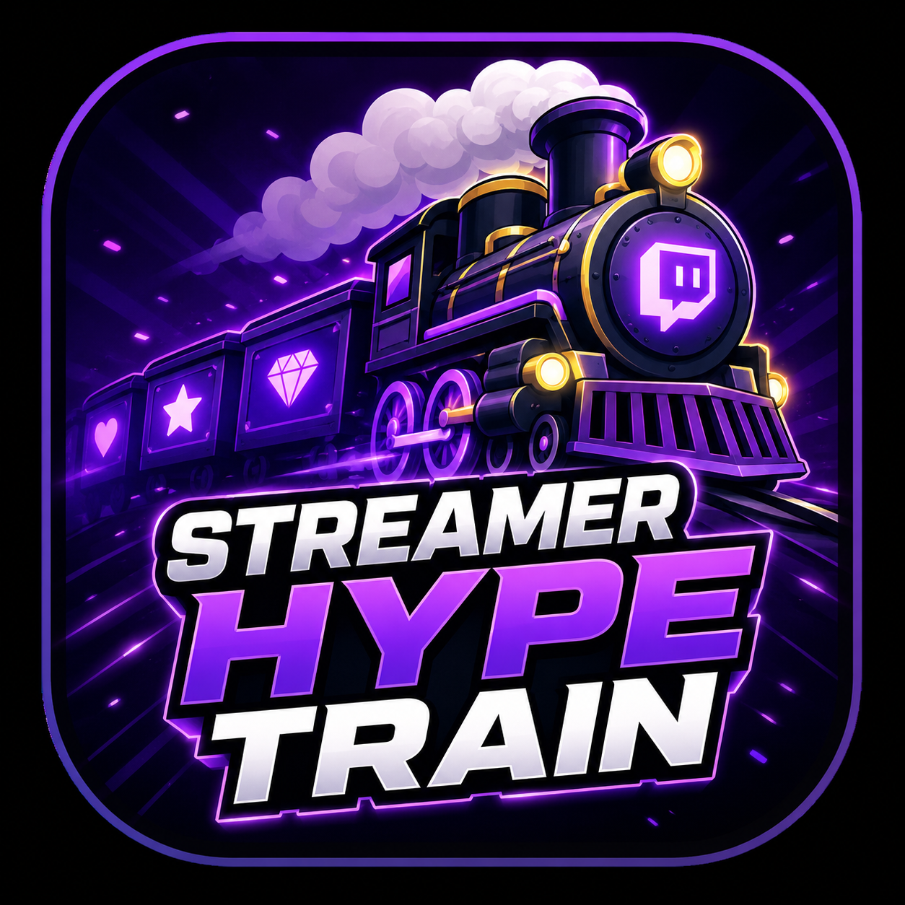
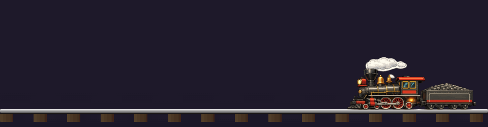

  

# 🚂 Streamer Hype Train

Lokale Windows-App (C# WinForms + WebView2), die einen OBS-Overlay-Zug für Twitch-Hype-Trains
steuert. Wenn ein Hype Train beginnt, erscheint eine Lokomotive unten rechts im Overlay und
"dampft" solange der Hype Train läuft. Jeder Zuschauer, der währenddessen mindestens eine
Chat-Nachricht schreibt, bekommt zufällig einen Avatar zugewiesen und "steigt" in einen Waggon
ein. Endet der Hype Train, fährt der komplette Zug (Lokomotive + ein Waggon pro Teilnehmer +
Endwagen) mit konstanter Geschwindigkeit nach links aus dem Bild.

## Funktionen
- Live-Overlay als OBS-Browserquelle (`overlay.html`), gesteuert per Server-Sent Events.
- Verwaltung als WebView2-Admin-Seite (`admin.html`): Bild-Uploads für Lokomotive/Endwagen/
  Waggon, Avatar-Verwaltung (Mehrfach-Upload), Sound-Uploads (Start/Warten/Abfahrt), Testlauf-Button.
- Twitch-Anbindung über EventSub (`channel.hype_train.begin/progress/end`, `channel.chat.message`).
- OBS-Anbindung per obs-websocket v5: legt Szene + Browser-Quelle automatisch an.
- Eine fertige Standard-Zuggrafik (Lokomotive, Waggon, Endwagen, 17 Avatare) ist bereits
  hinterlegt — direkt einsatzbereit, kann über die Admin-Oberfläche jederzeit ersetzt werden.
- Eingebauter Update-Mechanismus (lädt GitHub-Releases herunter und installiert sie automatisch).

## Setup
1. Exe starten, unter "Verbindung" mit Twitch anmelden (Broadcaster-Account) und optional OBS
   verbinden (Host/Port/Passwort eintragen, dann "Szene / Quelle erstellen").
2. Unter "Hypetrain" bei Bedarf eigene Bilder/Sounds hochladen (sonst gilt die mitgelieferte
   Standard-Grafik).
3. Falls OBS nicht automatisch eingerichtet wurde: `overlay.html` manuell als Browserquelle in
   OBS hinzufügen.
4. Mit dem "Hype Train testen"-Button die Animation ohne echten Hype Train ausprobieren.

Weitere technische Details: siehe `CLAUDE.md`.
